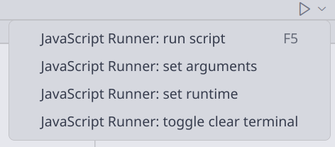

# Shell Runner

Run your current JavaScript or TypeScript file in the terminal.

## Features

- **One-click Run**: Instantly run the current js/ts script from the editor title bar.
- **Custom Runtime**: change the runtime used to run your scripts (default is `node`).
- **Auto Save**: Automatically saves the file before execution to ensure the latest content is run.
- **Argument Input & History**: Enter arguments for your script. Js Runner will remember the most recent arguments for up to 6 recently used files.
- **Terminal Reuse**: Reuses the terminal for repeated runs of the same script.
- **Clear Terminal Option**: Optionally clear the terminal before each run.

## Usage

1. Open any js/ts script file.
2. Click the "Run" button in the editor title bar to execute the script.
3. Use the argument button to input or edit script arguments.

## Screenshots

## Requirements

- VS Code version 1.74.0 or higher.

## Extension Settings

No additional configuration is required for this version.

## Release Notes

### 1.0.0

- Initial release with one-click run, argument input/history, sudo, and executable permission management.
